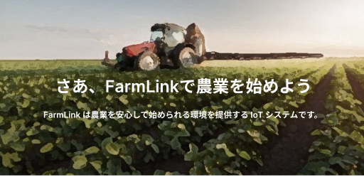

<div align="center">
  
  
  
  
  
</div>

<br>

<h2>📝 FarmLinkとは</h2>
<P>FarmLinkは農業を安心して始められる環境を提供するIoTシステムです。私たちが実際に農業を始める際にどんな問題に直面し、その問題を解決するにはどんな機能が必要かを考えて開発しました。</p>

<br>

<h2>👀 メンバー</h2>
<a href="https://github.com/yushin-ito"></a>
<a href="https://github.com/chibana-kit"></a>
<a href="https://github.com/r02i31"></a>
<a href="https://github.com/HipsMaro"></a>
<a href="https://github.com/ihsikawa"></a>
<a href="https://github.com/Keisuke373"></a>
<a href="https://github.com/rikuma77"></a>

<br>
<br>

<h2>📱 インストール</h2>


<br>

<h2>🔧 ビルド</h2>

```
git clone https://github.com/yushin-ito/farmlink.git
cd app
npx expo start
```

<br>
<br>

<h2>🚀 機能</h2>
<h3>・ レンタル</h3>


<br>
<h3>・ コミュニティ</h3>


<br>
<h3>・ ファーム</h3>


<br>
<h3>・ 設定</h3>


<br>

<h2>🛠️ 技術スタック</h2>
<div align="center">
  
  
</div>

<br>

<h2>🌐 システム構成</h2>
<div align="center">
  
  
</div>

<br>

<h2>📊 ER図</h2>


<br>

<h2>✅ Todo</h2>
<ul>
  <li>Victoryを用いたグラフ表示</li>
  <li>レンタルの絞り込み機能</li>
  <li>パスワードリセット機能</li>
</ul>

<br>

<h2>📜 ライセンス</h2>
<a href="https://github.com/yushin-ito/farmlink/blob/main/LICENSE">MIT License<a>
