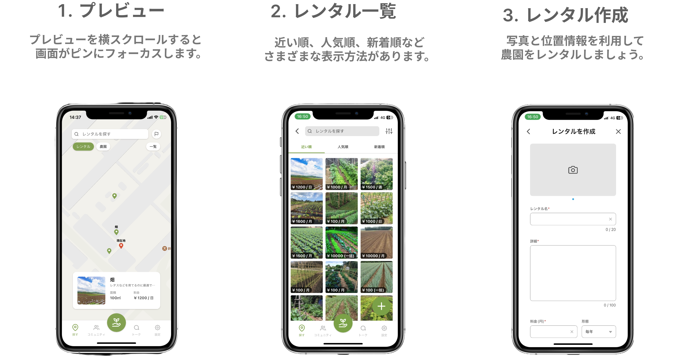
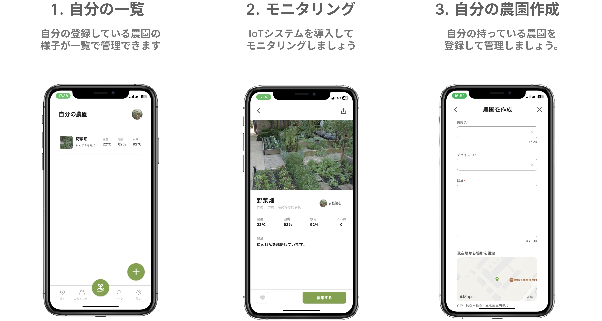
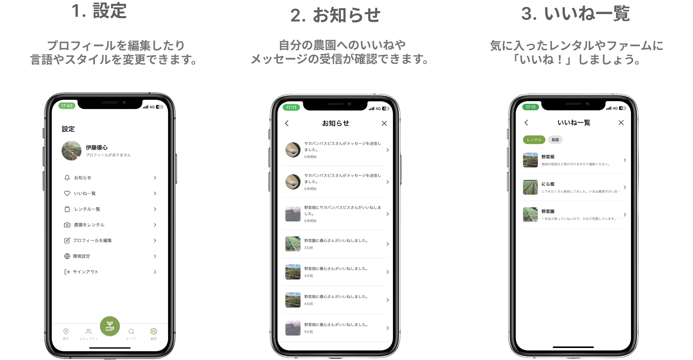
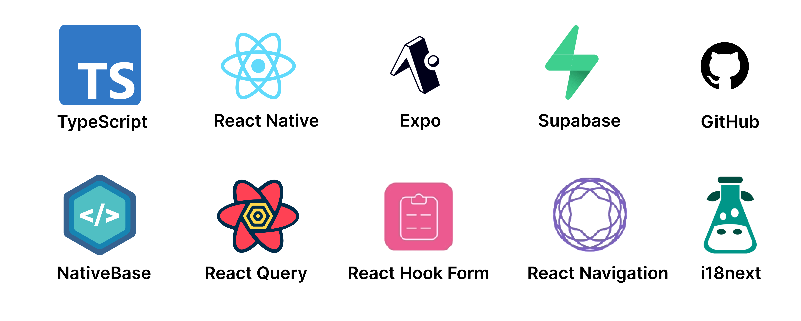

## インストール

[](https://github.com/expo/expo)
[](https://github.com/expo/expo)
[](https://github.com/expo/expo)

## 使い方

```
git clone https://github.com/yushin-ito/farmlink.git
cd app
npx expo start
```

## 機能

### ・ レンタル


<br>

### ・ コミュニティ


<br>

### ・ ファーム


<br>

### ・ ユーザー


<br>

## 技術スタック


<br>

## ライセンス
