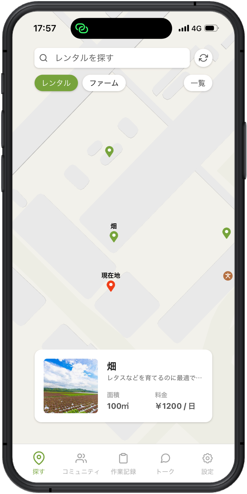

# FarmLink


[](https://github.com/expo/expo)
[](https://github.com/expo/expo)
[](https://github.com/expo/expo)

FarmLink は農業を安心して始められる環境を提供する IoT システムです。

## 使い方

```
git clone https://github.com/yushin-ito/farmlink.git
cd app
npx expo start
```

## 機能

<div>



</div>

## 技術スタック

## ライセンス
